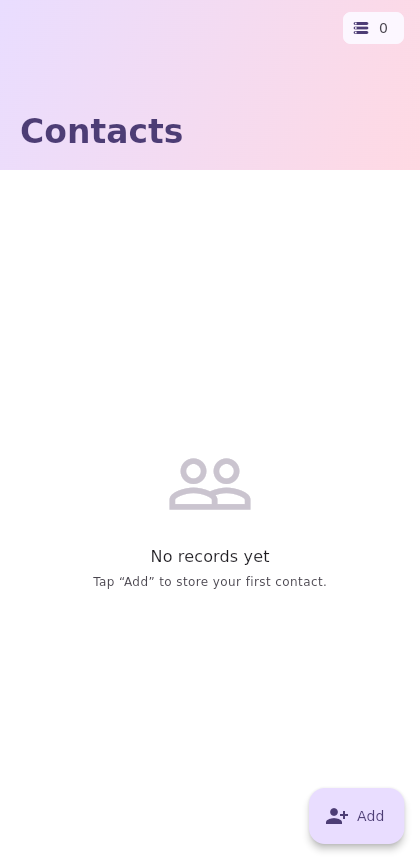
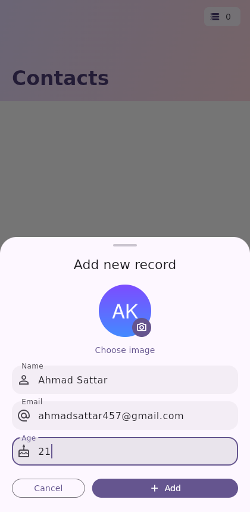
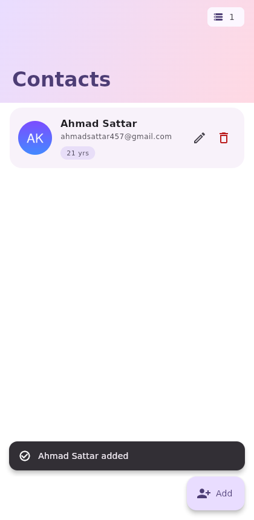
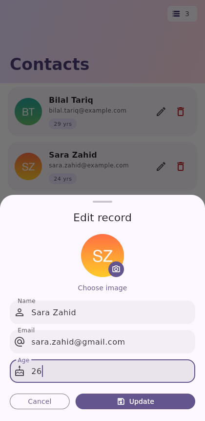
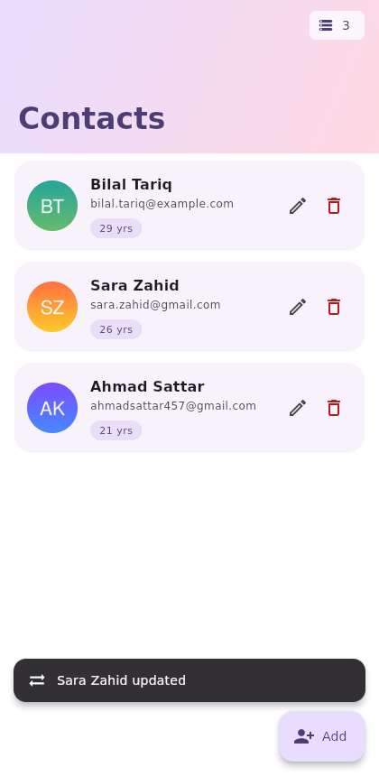
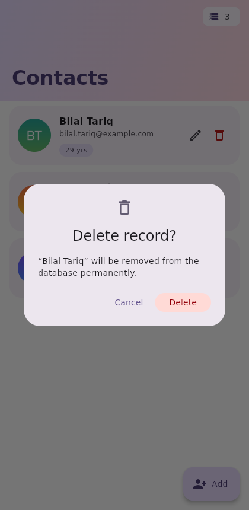
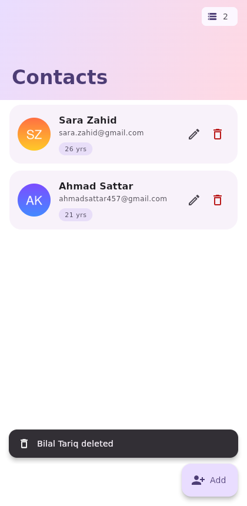
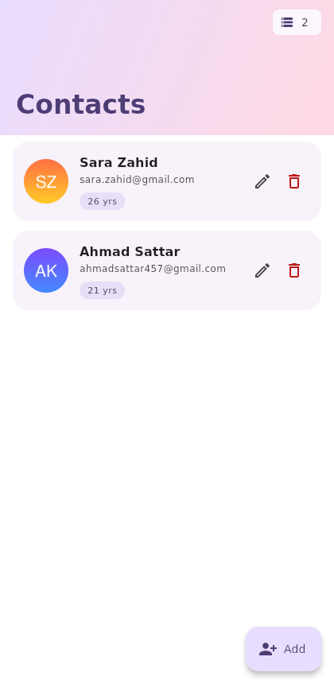

# Lab Assignment 1 — Flutter CRUD App with SQLite

**CSC303 — Mobile Application Development (CLO-2)**

A Flutter contacts app that performs **Add, Update and Delete** operations on a
local **SQLite** database. Each record stores an **image, name, email and age**,
and the data stays on the device after the app is closed.

## Contents

| Path | Description |
|---|---|
| `lib/` | Application source code |
| `pubspec.yaml` | Dependencies and project configuration |
| `screenshots/` | Screenshots of the Add, Update and Delete operations |
| `test/` | Unit tests for the `Person` model |
| `android/`, `ios/`, `linux/`, `macos/`, `web/`, `windows/` | Platform projects |

## Source files

| File | Responsibility |
|---|---|
| `lib/main.dart` | App entry point, Material 3 theme, SQLite initialisation |
| `lib/person.dart` | `Person` model + row ↔ object mapping |
| `lib/db_helper.dart` | SQLite database: create table, insert, query, update, delete |
| `lib/home_page.dart` | Record list, edit/delete actions, delete confirmation |
| `lib/person_form.dart` | Add / Edit form with image picker and field validation |

## Database

Table `persons` in `persons.db`, created on first launch:

| Column | Type |
|---|---|
| `id` | INTEGER PRIMARY KEY AUTOINCREMENT |
| `name` | TEXT NOT NULL |
| `email` | TEXT NOT NULL |
| `age` | INTEGER NOT NULL |
| `image_path` | TEXT |

The file is stored in the application documents directory, so records persist
across restarts. The chosen picture is copied into app storage as well, so it
is not lost when the system clears the picker cache.

## Packages used

- `sqflite` — SQLite database
- `sqflite_common_ffi` — SQLite support when running on desktop
- `path`, `path_provider` — locating the database and image files
- `image_picker` (+ `image_picker_linux`) — choosing a profile picture

## Features

- Add a record with image, name, email and age
- Edit an existing record and save it with **Update**
- Delete a record, with a confirmation dialog
- Form validation (required name, valid email format, age 1–120)
- Material 3 UI: gradient header, record count badge, avatar initials fallback,
  empty state and confirmation snackbars

## Screenshots

| | |
|---|---|
| **Home (no records yet)** |  |
| **Add — new record form** |  |
| **Add — record inserted** |  |
| **Update — edit form** |  |
| **Update — record saved** |  |
| **Delete — confirmation** |  |
| **Delete — record removed** |  |
| **Data still present after restarting the app** |  |

## Running

```bash
flutter pub get
flutter run
```
